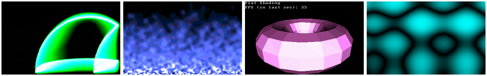

# demoscene-legacy

Back in the early 2000s, I was part of a Polish online group of
Assembler enthusiasts called New Age Assembler Group or NAAG 
(now defunct). Some of our works made it to the broader demoscene. 
For example, in June 2002 we released our only zine that can still
be found [here](http://www.pouet.net/prod.php?which=50666).

Here is a collection of graphical effects written originally for DOS 
in x86 Assembly language. Some of these effects were published on 
[Demozoo](https://demozoo.org/sceners/70017/), a demoscene site.

The effects are all implemented in 16-bit Assembly and use real mode. 
I have some better effects in 32-bit protected mode Assembly in 
a [new repository](https://github.com/efliks/megassembly).

This collection also contained effects written in C, but I have made 
a [separate repository](https://github.com/efliks/doseffects) for them.

## Compiling the effects

To compile and run the graphical effects, there are many options. You can use 
a retro PC with DOS, a virtual machine running DOS, or a PC emulator such as 
DOSBox or PCem.

For my development purposes, I use a VirtualBox VM with Win98. I also have 
a Pentium II PC for testing the "final product".

Secondly, you need some assembler. Back in the days, I used compilers
from Borland, legally or not. Luckily, they seem to have become abandonware.
For example, here you can download 
[Borland Turbo Assembler 5.0](https://winworldpc.com/product/turbo-assembler/5x).

Once you have the assembler installed, open the attached makefile and replace
the paths to TASM and TLINK with your own.

Then, simply run make:

```
c:\legacy > c:\tasm\bin\make.exe -f makefile
```

## Running the effects

At this point, you should have around 19 COM files. 

Press any key to quit. In *asmshade*, you can press [space] to cycle 
between different display modes, and [escape] to quit.

If you are using DOSBox, it may be that some effects run too slowly. 
It is possible to accelerate them to some degree by repeatedly 
pressing [ctrl + shift + f12], which will increase the number of "cycles" 
in DOSBox.

The effects rely on vertical retrace for timing. Unfortunately, in 
VirtualBox this feature seems to be broken, and the effects run very very 
fast. I will implement a better mechanism based on the PC timer, when 
the time permits.

## System requirements

The code is really ancient 16-bit Assembly, but it makes use of some 
32-bit instructions, eg. to accelerate copying display buffers. It also 
relies on the mathematical coprocessor.

It seems that a 386DX PC with a VGA video card is required just to start. 
I did the original development on a Pentium 133 Mhz PC, but I have never run 
these effects on anything slower.

Regarding the memory, all effects use the tiny memory model, but allocate some 
additional segments. 256 kB of free conventional memory should be enough.

## Final notes

The reason for publishing these programs here is solely because I think
they may still have some educational, fun or nostalgy value for some 
people.

I am the only developer of the programs. Licensing information can be 
found in COPYING.
